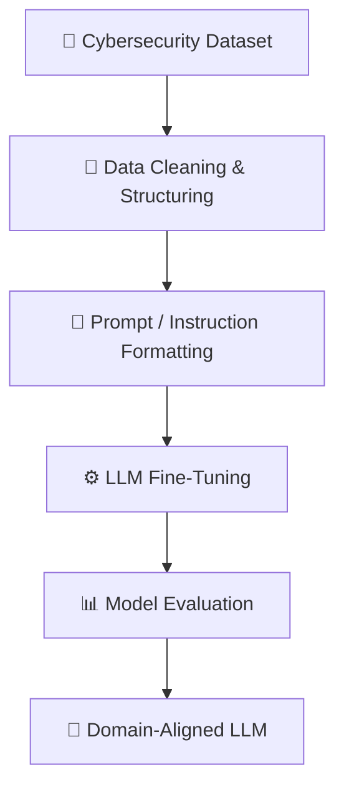

# 🔐 Cybersecurity-Focused Large Language Model Fine-Tuning  
## 🧠 Domain Adaptation of LLMs for Security Intelligence

> 🟢 **Status:** Completed Applied / Research Project  
> 🎓 **Level:** Graduate (M.Tech – Artificial Intelligence & Machine Learning)  
> 🛡️ **Focus:** LLM Fine-Tuning · Cybersecurity · Domain Adaptation · Applied NLP  

---

## ✨ Executive Summary

Large Language Models (LLMs) demonstrate strong general linguistic capabilities, yet **struggle with domain-specific reasoning** in high-risk fields such as cybersecurity, where **precision, context awareness, and terminology fidelity** are critical.

This project explores the **fine-tuning of a Large Language Model on cybersecurity-specific data**, with the goal of improving:

- Threat comprehension  
- Security incident interpretation  
- Attack pattern recognition  
- Domain-aligned response generation  

Rather than treating LLMs as black-box systems, this work emphasizes **controlled fine-tuning, data governance, and security-aware deployment considerations**.

---

## 🎯 Problem Motivation

🛡️ Cybersecurity language is fundamentally different from general web text:

| 🌐 General Language | 🔐 Cybersecurity Language |
|-------------------|---------------------------|
Ambiguous | Highly precise |
Context-agnostic | Context-critical |
Informal | Protocol-driven |
Low-risk | High-impact errors |

General LLMs often:
- Misinterpret attack vectors  
- Hallucinate mitigations  
- Confuse vulnerabilities with exploits  
- Fail to reason over security workflows  

📌 **Goal:** Align a general-purpose LLM with **cybersecurity-specific semantics and reasoning patterns**.

---

## 🧠 System Architecture Overview

### 🔗 Fine-Tuning Pipeline



---

## 📂 Dataset & Preparation

### 🔍 Dataset Characteristics
- Security incidents and attack descriptions  
- Structured and semi-structured records  
- Domain-specific terminology (CVE, exploits, attack vectors)  

### 🧹 Preprocessing Strategy
- Removal of sensitive credentials and secrets  
- Normalization of security terminology  
- Instruction-response formatting  
- Validation to prevent data leakage  

🔐 **Security Note:**  
All hard-coded API keys and secrets were removed and replaced with environment-based configuration.

---

## ⚙️ Fine-Tuning Strategy

### 🧠 Why Fine-Tuning (Not Prompting Alone)?

| Technique | Limitation |
|---------|------------|
Prompt Engineering | Shallow adaptation |
Few-shot Learning | Inconsistent behavior |
Fine-Tuning | Deep domain alignment |

Fine-tuning enables:
- Persistent domain knowledge  
- Reduced hallucinations  
- More deterministic responses  
- Improved reasoning consistency  

---

### 🔁 Training Workflow


---

## 📊 Evaluation Philosophy

Rather than relying solely on generic NLP metrics, evaluation focuses on:

- ✔ Terminology correctness  
- ✔ Logical consistency  
- ✔ Security relevance  
- ✔ Failure mode analysis  

This reflects **real-world cybersecurity constraints**, where incorrect outputs can have serious consequences.

---

## 🛠️ Technology Stack

| Layer | Tools |
|-----|------|
LLM Platform | OpenAI API |
Language | Python 🐍 |
Data Handling | Pandas, NumPy |
Workflow | Jupyter Notebook |
Security | Environment Variables (.env) |

---

## 📁 Repository Structure

```text
cybersecurity-llm-finetuning/
│
├── notebooks/
│   └── Fine_Tuning_notebook.ipynb
│
├── data/
│   └── Attack_Dataset.xlsx
│
├── docs/
│   └── AICS_Implementation_Report.pdf
│
├── requirements.txt
├── .gitignore
└── README.md
```

---

## 🚀 How to Run

```bash
pip install -r requirements.txt
jupyter notebook
```

Then open:
```text
notebooks/Fine_Tuning_notebook.ipynb
```

🔐 Ensure API keys are set via environment variables:
```bash
export OPENAI_API_KEY="your_key_here"
```

---

## 🌍 Practical Applications

- AI-assisted threat analysis  
- Security operations support (SOC)  
- Cybersecurity education tools  
- Incident response augmentation  
- Research into secure AI systems  

---

## 🔮 Future Extensions

- 🧠 Multi-task fine-tuning (classification + generation)  
- 🔄 Continuous learning with live threat feeds  
- 🛡️ Integration with SIEM pipelines  
- 📊 Explainability for security outputs  

---

## 👤 Author

**Kupakwashe T. Mapuranga**  
🎓 M.Tech – Artificial Intelligence & Machine Learning  

🔬 Interests:
- Secure AI Systems  
- Domain-Specialized LLMs  
- Applied NLP  
- AI Safety & Reliability  

---

> ⚠️ **Disclaimer:**  
> This project is for academic and research purposes only. It does not constitute a production-ready security system.
